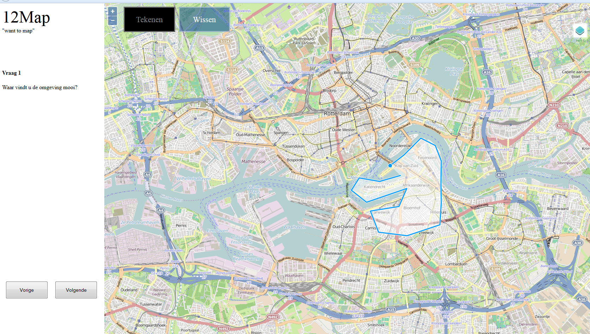

Mapping citizen's perception
========================================================
author: Rony and Samantha
date: 30 January 2015

Our geo objective
========================================================
class: text
Map the local citizen's perception of their living environment  using 12map data.

Area of interest: Lunetten

Today's topics
========================================================
class: text

- What is 12map?
- Our ambition
- Scripting method
- Results
- Conclusions
- Learning outcomes

What is 12map?
========================================================
class: text
It's an app, accessible via mobile devices

Answer questions about your living environment by drawing polygons

Generates dataset of rasters suitable for fancy statistical analysis

Can be used to support decision-making processes of urban planners

An example
========================================================
class: text

Current issues
========================================================
class: text
Data processing requires manual loading of data in QGIS

Script for processing rasters is inefficient and slow

Lack of automation and reproducibility

Our ambition
========================================================
class: text
1. Code a fast, reproducible and automated preprocessing script

2. Explore possibilities to create on-the-spot interactive map showing first results

Our scripting method
========================================================
class: text
1. Download, load and sort data
2. Create mosaic raster of answers per question
3. Perform basic statistical analysis
4. Visualize and map the results
5. Make the map interactive

Results
========================================================
class: text

Heat maps for all the answers per question

An interactive map plotting all heat maps in googlemaps

[Mapping Perception App](https://sammartindelc.shinyapps.io/Map-app/)

Statics didn't work out

Conclusion
========================================================
class: text

**It works**... but

- Script is still slow; different approach for raster calculations required

- Interactive map not fully automated; menu requires manual text input

What did we learn?
========================================================
class: text

- **To think like a coder**

- **Asking google the right questions**

- **Amazigness of Github**, working with branches and using the terminal

- **Splitting up scripting work**, but combining scripts is a challenge

- **Scripting is a creative and fun process**, especially when you fix an impossible error or issue

========================================================

~~Any questions?~~  
=

Join us on [Github](https://www.github.com/Gendow/FinalAssignment.git)  
